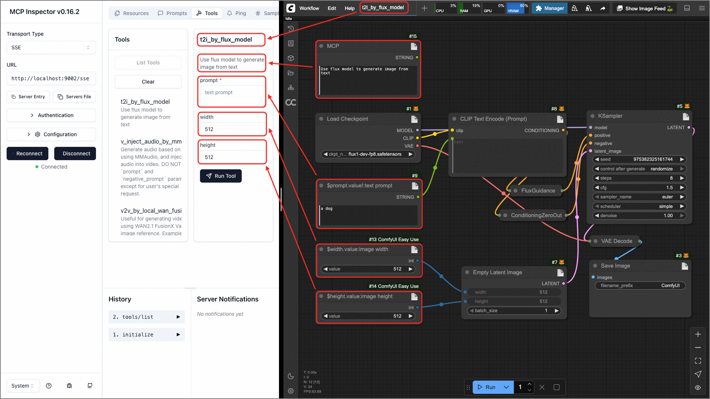
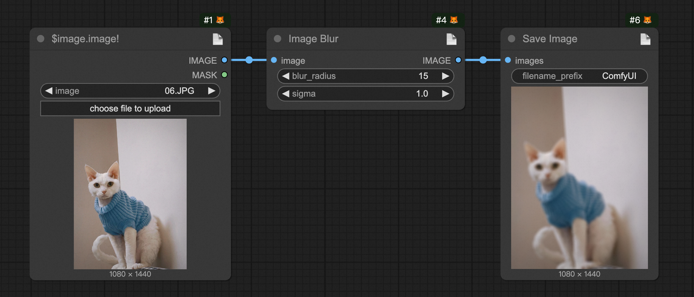

<h1 align="center">🎨 Pixelle MCP - 全模态融合智能体框架</h1>

<p align="center"><a href="README.md">English</a> | <b>中文</b></p>

<p align="center">✨ 基于 MCP 协议的 AIGC 方案，支持本地ComfyUI和云端ComfyUI(RunningHub)双模式，0代码将工作流转化为 MCP Tool。</p>


https://github.com/user-attachments/assets/7f0fc42f-9c44-4ab0-aaa8-1072082964c1


## 📋 最近更新

- ✅ **2025-09-29**：新增RunningHub云端ComfyUI支持，无需本地GPU和ComfyUI环境也能运行工作流
- ✅ **2025-09-03**：架构重构，从三服务合并为统一应用；新增CLI工具支持；发布到 [PyPI](https://pypi.org/project/pixelle/)
- ✅ **2025-08-12**：集成 LiteLLM 框架，新增 Gemini、DeepSeek、Claude、Qwen 等多模型支持


## 🚀 功能特性

- ✅ 🔄 **全模态支持**: 支持TISV（Text、Image、Sound/Speech、Video）全模态的互转和生成
- ✅ 🚀 **双运行模式**: 本地ComfyUI自建环境 + RunningHub云端ComfyUI服务，用户可根据需求灵活选择
- ✅ 🔧 **零代码开发**: 制定并实现了 Workflow 即 MCP Tool 的方案，0代码开发，即可动态添加新的 MCP Tool
- ✅ 🗄️ **MCP Server**: 基于[MCP](https://modelcontextprotocol.io/introduction)协议提供功能支持，支持任意mcp client集成（包含但不限于Cursor、Claude Desktop等）
- ✅ 🌐 **Web界面**: 基于[Chainlit](https://github.com/Chainlit/chainlit)框架开发，继承了Chainlit的UI交互控件，支持集成更多的MCP Server
- ✅ 📦 **一键部署**: 支持PyPI安装、CLI命令行、Docker等多种部署方式，开箱即用
- ✅ ⚙️ **简化配置**: 采用环境变量配置方案，配置简单直观
- ✅ 🤖 **多LLM支持**: 支持多种主流LLM，包括OpenAI、Ollama、Gemini、DeepSeek、Claude、Qwen等


## 📁 项目架构

Pixelle MCP 采用**统一架构设计**，将MCP服务端、Web界面和文件服务整合为一个应用，提供：

- 🌐 **Web界面**: 基于 Chainlit 的聊天界面，支持多模态交互
- 🔌 **MCP端点**: 供外部MCP客户端（如Cursor、Claude Desktop）连接
- 📁 **文件服务**: 处理文件上传、下载和存储
- 🛠️ **工作流引擎**: 支持本地ComfyUI和云端ComfyUI(RunningHub)工作流，自动将工作流转换为MCP工具


<div id="tutorial-start" />

## 🏃‍♂️ 快速开始

选择最适合你的部署方式，从简单到复杂：

### 🎯 方式1：一键体验

> 💡 **零配置启动，适合快速体验和测试**

#### 🚀 临时运行

```bash
# 首先需要安装uv环境
# 一条命令启动，无需安装到系统
uvx pixelle@latest
```

📚 **[查看uvx完整命令手册 →](docs/CLI_CN.md#uvx-方式)**

#### 📦 持久安装

```bash
# 这里需要在python3.11的环境中进行安装
pip install -U pixelle

# 启动服务
pixelle
```

📚 **[查看pip完整命令手册 →](docs/CLI_CN.md#pip-install-方式)**

启动后会自动进入**配置向导**，引导你选择执行模式(本地ComfyUI或云端RunningHub)和LLM配置。

### 🛠️ 方式2：本地开发部署

> 💡 **支持自定义工作流和二次开发**

#### 📥 1. 获取源码

```bash
git clone https://github.com/AIDC-AI/Pixelle-MCP.git
cd Pixelle-MCP
```

#### 🚀 2. 启动服务

```bash
# 交互模式（推荐）
uv run pixelle
```

📚 **[查看完整CLI命令手册 →](docs/CLI_CN.md#uv-run-方式)**

#### 🔧 3. 添加自定义工作流（可选）

```bash
# 复制示例工作流到数据目录（在您希望的项目目录中运行此命令）
cp -r workflows/* ./data/custom_workflows/
```

**⚠️ 重要**：务必先在ComfyUI中测试工作流能正常运行，否则后续执行会失败。

### 🐳 方式3：Docker部署（生产环境）

> 💡 **适合生产环境和容器化部署**

#### 📋 1. 准备配置

```bash
git clone https://github.com/AIDC-AI/Pixelle-MCP.git
cd Pixelle-MCP

# 创建环境配置文件
cp .env.example .env
# 编辑 .env 文件，配置你的ComfyUI地址和LLM设置
```

#### 🚀 2. 启动容器

```bash
# 后台启动所有服务
docker compose up -d

# 查看日志
docker compose logs -f
```

### 🌐 访问服务

无论使用哪种方式，启动完成后都可以通过以下地址访问：

- **🌐 Web界面**: http://localhost:9004  
  *默认用户名密码均为`dev`，可在启动后修改*
- **🔌 MCP端点**: http://localhost:9004/pixelle/mcp  
  *供Cursor、Claude Desktop等MCP客户端连接*

**💡 端口配置**：默认端口为9004，可通过环境变量 `PORT=你的端口` 自定义。

### ⚙️ 首次配置

首次启动时，系统会自动检测配置状态：

1. **🚀 执行模式选择**：选择本地ComfyUI或云端RunningHub（推荐新手选择RunningHub）
2. **🤖 LLM配置**：至少配置一个LLM提供商（OpenAI、Ollama等）
3. **📁 工作流目录**：系统会自动创建必要的目录结构

#### 🌟 **RunningHub云端模式优势**
- **零门槛**：无需本地安装ComfyUI、下载模型或配置插件
- **高性能**：企业级GPU资源，执行速度快
- **稳定性**：专业运维保障，服务可靠性高
- **即开即用**：注册账号即可开始使用ComfyUI工作流

#### 🔧 **本地ComfyUI模式优势**  
- **完全控制**：可自定义安装任意插件和模型
- **隐私保护**：数据完全在本地处理
- **离线使用**：配置完成后无需网络连接
- **成本控制**：使用自己的硬件资源

**🆘 需要帮助？** 加入社区群组获取支持（见下方社区交流部分）

## 🛠️ 添加自己的MCP Tool

⚡ 一个工作流即为一个MCP Tool，支持两种添加方式：

📋 **方式1：本地ComfyUI工作流** - 导出API格式的工作流文件
📋 **方式2：RunningHub工作流ID** - 直接使用云端工作流编号



### 🎯 1. 添加最简单的MCP Tool

* 📝 在ComfyUI中搭建一个实现图片高斯模糊的工作流（[点击获取](docs/i_blur_ui.json)），然后将 `LoadImage `节点的 title 改为 `$image.image!`，如下图


* 📤 然后将其导出为api格式文件，并重命名为 `i_blur.json`，你可以自己导出，也可以直接使用我们为你导出好的（[点击获取](docs/i_blur.json)）

* 📋 复制导出的API格式工作流文件（注：务必是API格式的），在web页面输入，并LLM添加这个Tool

  

* ✨ 消息发送后，LLM会让将这个工作流自动转化为一个MCP Tool

  

* 🎨 此时，刷新页面，再发送任意图片，即可实现基于LLM进行的高斯模糊处理

  

### 🔌 2. 添加复杂的MCP Tool

📊 添加MCP Tool的步骤和前面一样，唯一不一样的就是工作流部分（点击下载工作流：[UI格式](docs/t2i_by_flux_turbo_ui.json) 和 [API格式](docs/t2i_by_flux_turbo.json)）

> **注：** 使用RunningHub时，只需输入对应的工作流ID即可，无需下载和上传工作流文件。


## 🔧 ComfyUI Workflow 自定义规范

### 🎨 工作流格式
系统支持 ComfyUI 的工作流，只需要在画布中设计好工作流，然后导出为 API 格式即可。通过在节点标题中使用特殊语法来定义参数和输出。

### 📝 参数定义规范

在 ComfyUI 画布中，双击节点标题进行编辑，使用以下 DSL 语法定义参数：

```
$<参数名>.[~]<字段名>[!][:<描述信息>]
```

#### 🔍 语法说明：
- `参数名`：生成的MCP工具函数的参数名
- `~`：可选，表示对URL参数进行上传处理，返回相对路径
- `字段名`：节点中对应的输入字段名
- `!`：表示该参数为必需参数
- `描述信息`：参数的描述

#### 💡 操作示例：

**必需参数示例：**

- LoadImage 节点标题设为：`$image.image!:输入图片URL`
- 含义：创建名为 `image` 的必需参数，对应节点的 `image` 字段

**URL上传处理示例：**

- 任意节点标题设为：`$image.~image!:输入图片URL`
- 含义：创建名为 `image` 的必需参数，系统会自动下载URL并上传到ComfyUI，返回相对路径

> 📝 注：`LoadImage`、`VHS_LoadAudioUpload`、`VHS_LoadVideo` 等节点已内置此功能，无需添加 `~` 标记


### 🎯 类型推断规则

系统会根据节点字段的当前值自动推断参数类型：
- 🔢 `int` 类型：整数值（如 512, 1024）
- 📊 `float` 类型：浮点数值（如 1.5, 3.14）
- ✅ `bool` 类型：布尔值（如 true, false）
- 📝 `str` 类型：字符串值（默认类型）

### 📤 输出定义规范

#### 🤖 方式1：自动识别输出节点
系统会自动识别以下常见的输出节点：
- 🖼️ `SaveImage` - 图片保存节点
- 🎬 `SaveVideo` - 视频保存节点
- 🔊 `SaveAudio` - 音频保存节点
- 📹 `VHS_SaveVideo` - VHS视频保存节点
- 🎵 `VHS_SaveAudio` - VHS音频保存节点

#### 🎯 方式2：手动标记输出
> 一般用在包含多个输出的场景
在任意节点的标题中使用 `$output.变量名` 来标记输出：
- 节点标题设为：`$output.result`
- 系统会将此节点的输出作为工具的返回值


### 📄 工具描述配置（可选）

可以在工作流中添加一个标题为 `MCP` 的节点来提供工具描述：

1. 添加一个 `String (Multiline)` 或类似的文本节点 (需符合：单字符串属性，且节点字段为以下任意一个：value, text, string)
2. 将节点标题设为：`MCP`
3. 在节点的值字段中输入工具的详细描述


### ⚠️ 重要注意事项

1. **🔒 参数验证**：标记为可选的参数（没有!符号）必须在节点中设置默认值
2. **🔗 节点连接**：已连接到其他节点的字段不会被解析为参数
3. **🏷️ 工具命名**：导出的文件名将作为工具名称，建议使用有意义的英文名称
4. **📋 描述详细**：尽量在参数描述中提供详细说明，提升用户体验
5. **🎯 导出格式**：必须导出为 API 格式，不要导出 UI 格式

<div id="tutorial-end" />

## 💬 社区交流

扫描下方二维码加入我们的社区，获取最新动态和技术支持：

|                         微信交流群                         |                         Discord 社区                         |
| :--------------------------------------------------------: | :----------------------------------------------------------: |
|  |  |

## 🤝 如何参与共建

我们欢迎所有形式的贡献！无论您是开发者、设计师还是用户，都可以通过以下方式参与项目建设：

### 🐛 报告问题
* 📋 在 [Issues](https://github.com/AIDC-AI/Pixelle-MCP/issues) 页面提交 Bug 报告
* 🔍 提交前请先搜索是否已有相似问题
* 📝 请详细描述问题的复现步骤和环境信息

### 💡 功能建议
* 🚀 在 [Issues](https://github.com/AIDC-AI/Pixelle-MCP/issues) 中提交功能请求
* 💭 描述您希望添加的功能及其使用场景
* 🎯 解释该功能如何改善用户体验

### 🔧 代码贡献

#### 📋 贡献流程
1. 🍴 Fork 本仓库到您的 GitHub 账户
2. 🌿 创建功能分支：`git checkout -b feature/your-feature-name`
3. 💻 进行开发并添加相应的测试
4. 📝 提交更改：`git commit -m "feat: add your feature"`
5. 📤 推送到您的仓库：`git push origin feature/your-feature-name`
6. 🔄 创建 Pull Request 到主仓库

#### 🎨 代码规范
* 🐍 Python 代码遵循 [PEP 8](https://pep8.org/) 规范
* 📖 为新功能添加适当的文档和注释

### 🧩 贡献工作流
* 📦 分享您的 ComfyUI 工作流到社区
* 🛠️ 提交经过测试的工作流文件
* 📚 为工作流添加使用说明和示例


## 🙏 致谢

❤️ 衷心感谢以下所有组织、项目和团队，为本项目的发展和落地提供了支持。

* 🧩 [ComfyUI](https://github.com/comfyanonymous/ComfyUI)
* 💬 [Chainlit](https://github.com/Chainlit/chainlit)
* 🔌 [MCP](https://modelcontextprotocol.io/introduction)
* 🎬 [WanVideo](https://github.com/Wan-Video/Wan2.1)
* ⚡ [Flux](https://github.com/black-forest-labs/flux)
* 🤖 [LiteLLM](https://github.com/BerriAI/litellm)

## License
本项目基于MIT许可证（[LICENSE](LICENSE), SPDX-License-identifier: MIT）发布。

## ⭐ Star History

[](https://star-history.com/#AIDC-AI/Pixelle-MCP&Date)
