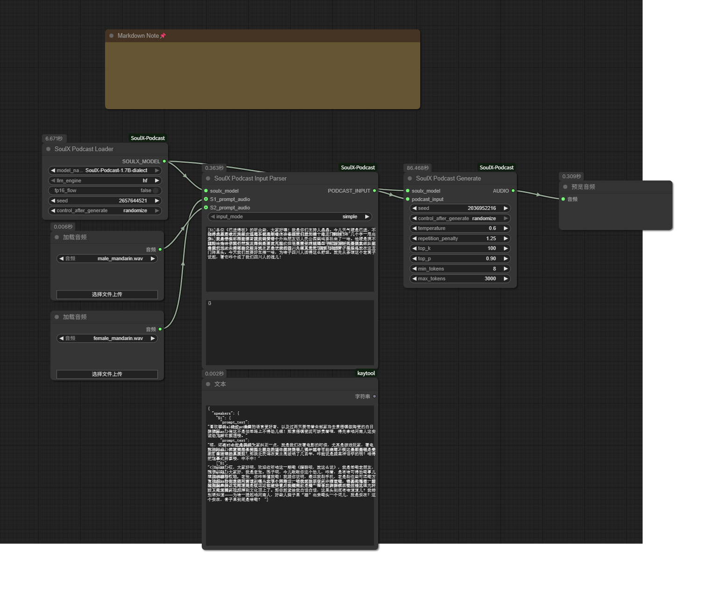

# ComfyUI-SoulX-Podcast

**[English](README_EN.md) | [中文](README.md)**

## Project Introduction

ComfyUI-SoulX-Podcast is a custom node plugin for ComfyUI that packages the core functionality of SoulX-Podcast (long-form, multi-speaker, multi-dialect podcast voice generation) into a visual node workflow.

## ✨ Key Features

- 🎙️ **Two-Person Podcast Generation**: Supports dialogue generation between two speakers
- 🌍 **Multi-Dialect Support**: Supports multiple Chinese dialects (requires dialect model)
- 📝 **Flexible Dialogue Scripts**: Define dialogues through simple script format
- 🎵 **Prompt Audio Driven**: Clone speaker voice characteristics using reference audio (Suno)
- 🔄 **Long-Form Generation**: Supports generation of long-form podcast content
- 🎛️ **Visual Workflow**: Complete the entire generation process through node connections in ComfyUI

## 📦 Installation & Requirements

### Python Dependencies

Ensure your ComfyUI environment has the following key dependencies installed:

```bash
s3tokenizer
diffusers
torch (requires CUDA support)
transformers
onnxruntime (or onnxruntime-gpu)
einops
librosa
scipy
```

> **⚠️ Important Note**: This project requires `transformers==4.57.1`. Please install with caution as other versions may cause compatibility issues.

### Model Preparation

Model files must be placed in ComfyUI's standard model directory:

```
ComfyUI/models/TTS/[model_name]/
```

**Directory Structure Example**:

```
ComfyUI/
  └── models/
      └── TTS/
          └── SoulX-Podcast-1.7B/
              ├── soulxpodcast_config.json
              ├── flow.pt
              ├── hift.pt
              ├── campplus.onnx
              └── [LLM model files...]
```

**Model Type Description**:

- **Standard Model** (e.g., `SoulX-Podcast-1.7B`): Suitable for standard Mandarin podcast generation
- **Dialect Model** (e.g., `SoulX-Podcast-1.7B-dialect`): Supports multiple Chinese dialects, such as Henan dialect, Sichuan dialect, Cantonese, etc.

> **Important Note**: To use dialect features, please ensure you load the `SoulX-Podcast-1.7B-dialect` model. Select the corresponding dialect model in the `model_name` parameter of the **SoulX Podcast Loader** node.

## 🚀 Quick Start

### Basic Workflow

1. **SoulX Podcast Loader** - Load models
2. **Load Audio** - Prepare prompt audio for each speaker (using ComfyUI's "Load Audio" node)
3. **SoulX Podcast Input Parser** - Parse inputs and dialogue script
4. **SoulX Podcast Generate** - Generate podcast audio
5. **Preview/Save Audio** - Use ComfyUI's audio save node

### Workflow Example

Here is a complete ComfyUI workflow example demonstrating how to use these nodes:



**Import Workflow**:

You can directly import the workflow JSON file in ComfyUI: `example/example_workflow.json`

This example includes:
- Model loading configuration
- Two-speaker prompt audio (male and female voices)
- Complete dialogue script example
- All necessary node connections

## 📖 Node Description

### Node 1: SoulX Podcast Loader

**Function**: Loads all required models and tokenizers in one go.

#### Input Parameters

| Parameter | Type | Default | Description |
|-----------|------|---------|-------------|
| **model_name** | Dropdown | First available model | Select the model to use from `models/TTS/` directory |
| **llm_engine** | Selection | `hf` | LLM inference engine: `hf` (HuggingFace) or `vllm` |
| **fp16_flow** | Boolean | `False` | Whether to use FP16 precision for Flow model |
| **seed** | Integer | `1988` | Random seed, range: 0 to 4294967295 |

#### Output

- **SOULX_MODEL**: Object containing all loaded models

---

### Node 2: SoulX Podcast Input Parser

**Function**: Processes all input data (audio, text, dialogue script) and preprocesses it into a format usable by the model. **Supports two-person dialogue (S1 and S2)**.

#### Required Inputs

| Parameter | Type | Description |
|-----------|------|-------------|
| **soulx_model** | SOULX_MODEL | Model object from SoulX Podcast Loader node |
| **input_mode** | Selection | Input mode: `simple` (simple mode) or `json` (JSON mode) |

#### Simple Mode Inputs (input_mode = "simple")

| Parameter | Type | Description |
|-----------|------|-------------|
| **S1_prompt_audio** | AUDIO | Speaker 1 (S1) prompt audio for extracting voice characteristics |
| **S2_prompt_audio** | AUDIO | Speaker 2 (S2) prompt audio (optional, for two-person dialogue) |
| **dialogue_script** | Multi-line text | Dialogue script defining the entire podcast dialogue<br>Format: `[S1] First sentence\n[S2] Second sentence`<br>The system automatically extracts the first sentence from each speaker as prompt text |

#### Output

- **PODCAST_INPUT**: Object containing all preprocessed data

**Processing Flow**:
1. Parse dialogue script, extract text and speaker identifiers for each sentence
2. Extract speaker embedding features from prompt audio
3. Extract mel spectrogram features from audio
4. Convert text to token IDs
5. Package all preprocessed data

---

### Node 3: SoulX Podcast Generate

**Function**: Executes the core inference loop to generate the final podcast audio.

#### Required Inputs

| Parameter | Type | Description |
|-----------|------|-------------|
| **soulx_model** | SOULX_MODEL | Model object from Loader node |
| **podcast_input** | PODCAST_INPUT | Preprocessed data from Input Parser node |
| **seed** | Integer | Random seed |
| **temperature** | Float | LLM sampling temperature (default: 0.6, range: 0.1-2.0) |
| **repetition_penalty** | Float | Repetition penalty coefficient (default: 1.25, range: 1.0-2.0) |

#### Optional Inputs

| Parameter | Type | Default | Description |
|-----------|------|---------|-------------|
| **top_k** | Integer | 100 | Top-K sampling (range: 1-200) |
| **top_p** | Float | 0.9 | Nucleus sampling (range: 0.1-1.0) |
| **min_tokens** | Integer | 8 | Minimum tokens per sentence (range: 1-100) |
| **max_tokens** | Integer | 3000 | Maximum tokens per sentence (range: 100-5000) |

#### Output

- **AUDIO**: Generated complete podcast audio (24kHz, ComfyUI AUDIO format compliant)

---

## ⚙️ Parameter Tuning Suggestions

### Audio Quality Optimization

- **Prompt Audio Quality**: Use clear, noise-free prompt audio, 5-15 seconds duration is optimal
- **fp16_flow**: If you have sufficient VRAM, it's recommended to disable this for best audio quality

### Generation Stability

- **temperature**: 0.5-0.7 for dialogues, 0.7-0.9 for creative content
- **repetition_penalty**: 1.15-1.35 is a good range
- **top_k / top_p**: Keep defaults usually

### Performance Optimization

- **llm_engine**: Use `vllm` if available and you have sufficient VRAM for faster speed
- **fp16_flow**: Enable to reduce VRAM usage
- **max_tokens**: Adjust according to actual needs, don't set too large

---

## 🔧 FAQ

### Q1: Model Loading Failed

**Problem**: Error message "Model path does not exist" or "No models found"

**Solution**:
1. Ensure model files are placed in `ComfyUI/models/TTS/[model_name]/` directory
2. Check that the model directory contains all required files

### Q2: Unstable Voice Characteristics in Generated Audio

**Solution**:
1. Use longer, clearer prompt audio (recommended about 10 seconds)
2. Ensure prompt audio quality is good with no obvious noise

### Q3: Slow Generation Speed

**Solution**:
1. Use `vllm` engine if supported
2. Enable `fp16_flow` to reduce VRAM usage
3. Reduce `max_tokens` value

### Q4: Dialogue Script Format Error

**Wrong Example**:
```
S1 Hello  # ❌ Missing brackets
```

**Correct Format**:
```
[S1] Hello  # ✅ Correct
[S2] Hello  # ✅ Correct
```

---

## 📚 Technical Architecture

### Generation Pipeline

```
Text Input → LLM → Semantic Tokens → Flow → Mel Spectrogram → HiFT → Audio Waveform
```

### Core Models

- **LLM**: Qwen3-1.7B (Language Model)
- **Flow**: CausalMaskedDiffWithXvec (Acoustic Model)
- **HiFT**: HiFTGenerator (Vocoder)
- **Suno Extraction**: campplus.onnx (Speaker Embedding Extraction)

---

## 📄 License

This project is developed based on the SoulX-Podcast project. Please follow the license requirements of the original project.

---

## 🙏 Acknowledgments

- [SoulX-Podcast](https://github.com/...) - Original project
- ComfyUI Community

---

## 📧 Support

For questions or suggestions, please submit them in the project Issues.

